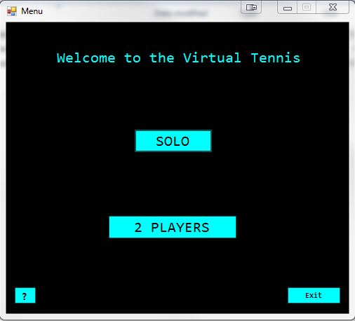
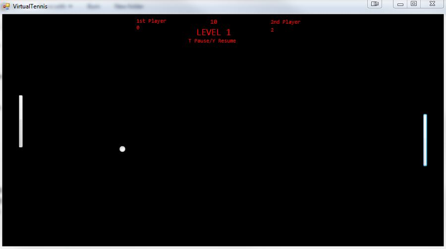
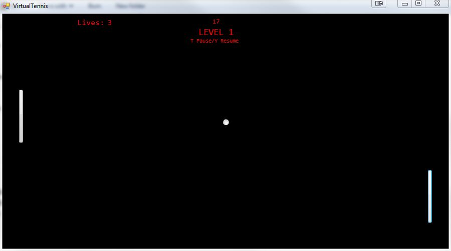

# VirtualTennis

This is a Virtual Tennis (Atari like) Desktop Game application for Windows, developed in C++/CLI. A quite challenging and interesting project at that time with no game engines used at all.

How to play: 

1) Download and install: <a href="http://www.microsoft.com/en-us/download/details.aspx?id=17718/">Microsoft .NET Framework 4 (Standalone Installer)</a>

2) Double click on the "VirtualTennisAdvanced" Application file.
 
- August 2015, Thessaloniki, Greece
- Nikiforos Archakis

<table>
 	<tr>
		<td></td>
		<td></td>
	</tr>
	
 	<tr>
		<td></td>
		<td></td>
	</tr>
</table>
